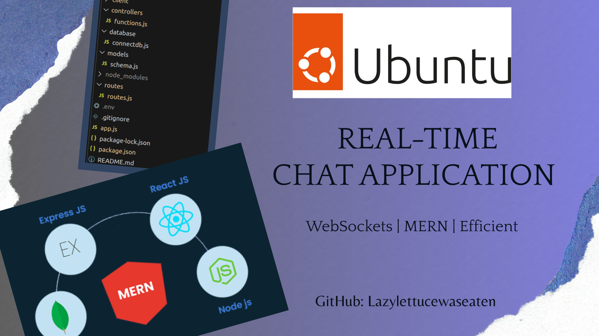
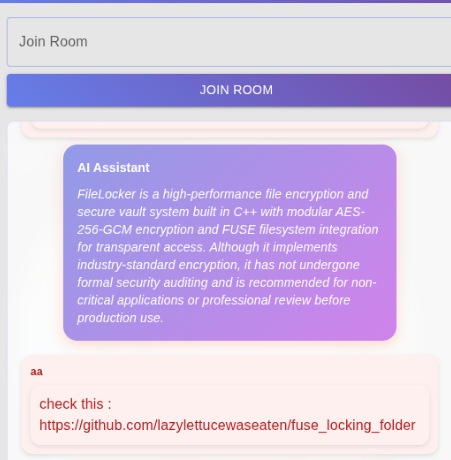
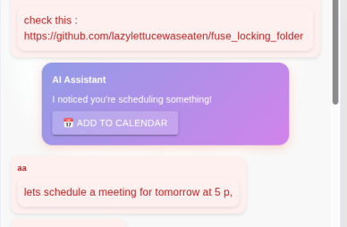

#  ChatApp

A full-stack, real-time group chat application featuring secure authentication, dynamic room management, and robust admin controls. Built using React, Node.js, Express, Socket.io, and MongoDB.

##  Live Demo & Video
You can try the live application here:
 **[https://chatapp.greatbrother864.workers.dev/](https://chatapp.greatbrother864.workers.dev/)**
*(Note: Initial loading might take a few moments due to free server hosting wake-up times)*

###  Watch the Demo
[](https://youtu.be/vT2dCCl6bTo?si=XB5A4LU6t_CjfNbr)

---

##  Features

- ** Generative AI Agents**: Powerful AI features built using the **Google Gemini API**:
  - **Generative UI Calendar Scheduler**: Detects scheduling intents in messages and dynamically injects "Add to Google Calendar" widgets directly into the chat stream.
  - **Link Summarizer**: Automatically scrapes and summarizes shared URLs using Cheerio and GenAI.
  - **Admin AI Controls**: Granular room-based toggles for admins to enable/disable specific AI features.
- ** Real-Time Messaging**: Built on **Socket.io** to enable instant, bi-directional messaging and user connection events.
- **Secure Authentication**: Includes user signup and login protected with **JWT (JSON Web Tokens)** and secure password hashing using **bcrypt**.
- **Dynamic Room Admin Controls**: 
  - Room creators automatically gain **Admin** status.
  - Admins can designate other users as admins.
  - Admins can permanently **delete rooms** and clear associated messages.
- **Polished UI**: A clean, responsive user interface built using **Material UI (MUI)**.
- **Message Persistence**: All chat histories and rooms are persisted reliably in **MongoDB**.

### AI Features in Action
<p align="center">
  
  &nbsp;
  
</p>

---

##  Tech Stack

- **Frontend**: React (Vite), Material UI (MUI), Axios, Socket.io-client
- **Backend**: Node.js, Express, Socket.io
- **Database**: MongoDB (via Mongoose)
- **Security**: JWT (jsonwebtoken), bcrypt

---

##  Project Setup

To run this project locally, you will need to set up both the backend and frontend.

### 1. Backend Setup

1. From the project root, create a `.env` file:
   ```env
   PORT=3000
   URI=your_mongodb_connection_uri
   JWT_SECRET=your_jwt_secret_key
   ENCRYPTION_KEY=your_32_character_aes_key
   GEMINI_API_KEY=your_google_gemini_api_key
   ```
2. Install backend dependencies:
   ```bash
   npm install
   ```
3. Start the backend server:
   ```bash
   npm start
   ```

### 2. Frontend Setup

1. Navigate to the `client/` folder:
   ```bash
   cd client
   ```
2. Install frontend dependencies:
   ```bash
   npm install
   ```
3. Start the development server:
   ```bash
   npm run dev
   ```

---

##  Project Structure

- `app.js` - Backend server entry point.
- `/routes/` - Express API routes (authentication, messages, admin controls).
- `/controllers/` - Backend business logic & database controllers.
- `/models/` - Mongoose schemas (Users, Messages, Rooms).
- `socket.js` - Socket.io connection and event handling.
- `/client/` - React frontend application.
